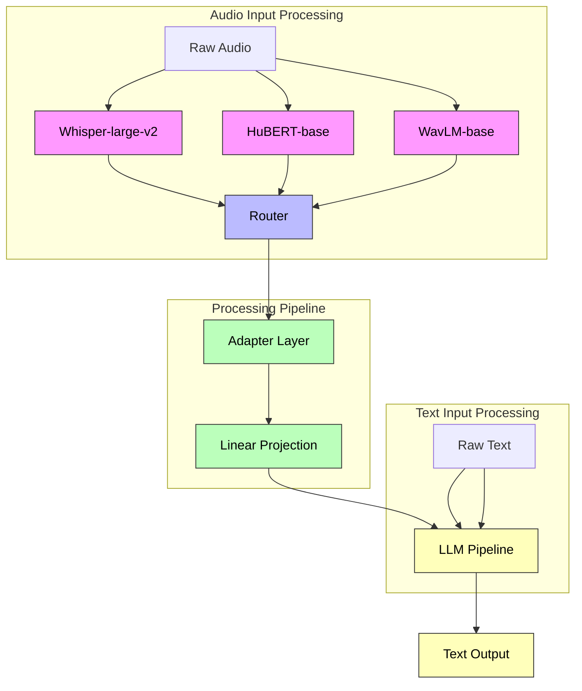
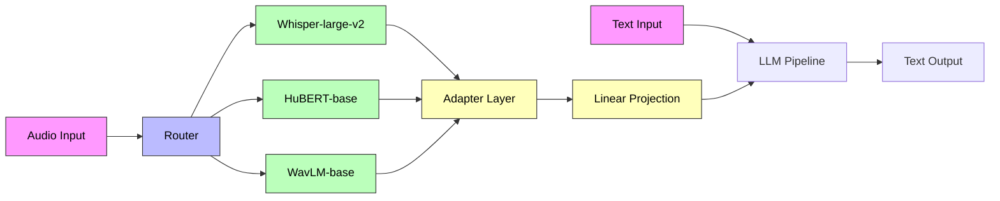

# ML_Projects

Based on recent research, I'll outline how to implement a speech-text multimodal model using Mixture of Experts (MoE) architecture. This approach combines specialized audio encoders with text processing capabilities while leveraging MoE for efficient resource utilization.

### System Architecture Overview

Let me first show you the overall system architecture:



The diagram shows the core architecture where:

- Multiple specialized audio encoders (Whisper-large-v2, HuBERT-base, WavLM-base) process the audio input in parallel
- The Router intelligently selects which encoders to activate for each input sample
- The Adapter Layer and Linear Projection transform the selected encoder outputs to match the LLM's expected format
- Both processed audio features and text inputs feed into the shared LLM pipeline

Now let's examine how the expert selection process works:



### Implementation Details

Based on recent research 1:1, here's how to implement this architecture effectively:

1.  Base Architecture Components:
          - Primary audio encoder (Whisper-large-v2 recommended)
  - Pool of specialized weak encoders (HuBERT-base, WavLM-base)
  - Intelligent routing mechanism
  - Shared LLM pipeline


2.  Expert Configuration Options:
          - Expert 1: Audio-relevant dataset derived from image datasets
  - Expert 2: Adapted from fine-tuned LLaVA model's MLP layers
  - Expert 3: Specialized for long speech tasks
  - Expert 4: Optimized for image-related tasks with textual information 0:0


3.  Performance Considerations:
          - Workload distribution varies by task type:
                    - Speech tasks primarily utilize Expert 3
    - Image-related tasks favor Expert 4
    - Video/audio combinations distribute workload between Experts 3 and 4 0:0


4.  Training Strategy:
          - Initialize audio encoders and LLM with pre-trained weights
  - Fine-tune simultaneously with MoWE routing
  - Use combined loss function:
                ```python
L = L_next-token + 0.1 * L_MoWE 
```


### Performance Metrics

Recent implementations have demonstrated competitive performance across various tasks 1:8:

- ASR (WER): ~2.05%
- Emotion Recognition: 1.45/5.0 score
- Audio Question Answering: 2.88/5.0 score
- Speech Question Answering: 3.88/5.0 score
- Audio Captioning (METEOR): 25.49

### Practical Recommendations

1. Start with a smaller model and gradually scale up experts
2. Implement selective activation of experts based on input characteristics
3. Consider task-specific fine-tuning for optimal performance
4. Monitor routing distributions to identify potential bottlenecks

This architecture provides a robust foundation for building multimodal models that effectively handle both speech and text inputs while maintaining efficient resource utilization through the MoE framework.
